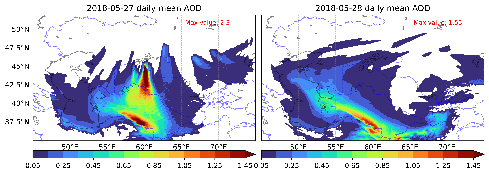

# Welcome to My Personal Website

I am a passionate graduate student with a strong interest in Data science. This website serves as a platform to showcase my work, projects, and thoughts on various topics.

## About Me

I like playing badminton, video game, and cooking.

- **Email:** di.sang@uconn.edu
- **LinkedIn:** [[my LinkedIn profile link](www.linkedin.com/in/di-sang)]
- **GitHub:** [[my GitHub profile link](https://github.com/sunday9877)]

## Projects
### Project 1

2023 Travelers Analytics Case Competition, Oct 2023- Dec 2023
- Link: [[Link to my medium story: Navigating Imbalanced Car Insurance Claim Data with Pervasive 0 Values](https://medium.com/@wosunday8769/navigating-imbalanced-car-insurance-claim-data-with-pervasive-0-values-37c67879c3e7)]
-	Led the design and implementation of a customized XGBoost regression model to forecast car insurance claim costs leveraging user data.
-	Spearheaded a 56.7% enhancement in predictive accuracy compared to the established benchmark model, showcasing the efficacy of the tailored XGBoost regression methodology.
-	Provided actionable insights into pivotal factors influencing car insurance claim costs, empowering informed strategic decision-making for the business partner.

### Project 2

A GIS dashboard project focusing on COPD in in Connecticut:
This dashboard shows COPD cases in Connecticut from 2001 to 2014, by population density. It's easy to use and lets you see how COPD cases have changed over time and where they're most common across different counties in Connecticut. By comparing COPD cases to population numbers, you can see which areas have more cases per person. You can also filter the data to focus on specific regions to get more detailed information. This helps people understand where COPD is a bigger issue and make decisions about how to address it.
- Data Collection and Preprocess:
- Create Map with GIS Online:
Import the preprocessed data into a GIS online platform.
Create a map showing locations, with customizable symbols and additional layers for context.
Create GIS Dashboard:
- Develop an interactive dashboard displaying the map and additional visualizations.
- Link: [[Link to the GIS dashboard](https://connecticut.maps.arcgis.com/apps/dashboards/dd7e74dadc5e4dbb910c48e42b70b6b6)]

### Project 3

A GIS dashboard project focusing on museums in Connecticut:

- Data Collection and Preprocess:
Gather museum data including locations, population in county, and other relevant details.
- Create Map with GIS Online:
Import the preprocessed data into a GIS online platform.
Create a map showing museum locations, with customizable symbols and additional layers for context.
Create GIS Dashboard:
- Develop an interactive dashboard displaying the map and additional visualizations.
Provide details about number of museum in CT.
- Link: [[Link to the GIS dashboard](https://connecticut.maps.arcgis.com/apps/dashboards/0302e48aba2447bab8c6442860e7e5b1)]

### Project 4

Medical insurance claim approval prediction using statistical models, Nov 2023 - Dec 2023
- Link: [[Link to my medium story: Medical insurance claim approval prediction project using statistical models from R](https://medium.com/@wosunday8769/medical-insurance-claim-approval-prediction-project-using-statistical-models-from-r-8f3fb8bef34c)]
- Analyzed data from medical insurance policyholders to uncover correlations among factors and predict insurance claim approvals using statistical classification methodologies (LM, Random Forest, Gradient Boosting) with R.
- Identified Random Forest as the most robust model, excelling in Precision(0.862), Recall(0.868), Accuracy(0.853), and F1 Score(0.865). Additionally, XGBoost demonstrated competitive performance across metrics.

### Project 5

Unsupervised learning of high school university admission data

### Project 6

Satellite data processiong and visulization
- **Description:** •	Satellite aerosol data analysis: Data Acquisition, Data Preprocessing, Data Visualization, Image Classification, and Interpretation.
- **GitHub Repository:** [[Link to my project's GitHub repository](https://github.com/sunday9877/satellite_data)]
- **Demo:** Spinning Enhanced Visible and InfraRed Imager (SEVIRI) RGB image 
- SEVIRI RGB animation showing a huge sand storm 

### Project 7

WRF-CHEM running
- **Description:** Weather Research and Forecasting (WRF) Model configuration and running with chem module to analzing aerosol movement.
- **Model:** My WRF model installing and configuration document is under [Link to doc](https://github.com/sunday9877/satellite_data/tree/main/wrf)]
- **Demo:** Model simulated aerosol optical depth(AOD) plot vs satellite measurement 

## Contact Me

Feel free to reach out to me:

- Email: di.sang@uconn.edu, hzwsunday@icloud.com

Thank you for visiting my website!

<!-- Add any additional sections or content as needed -->
